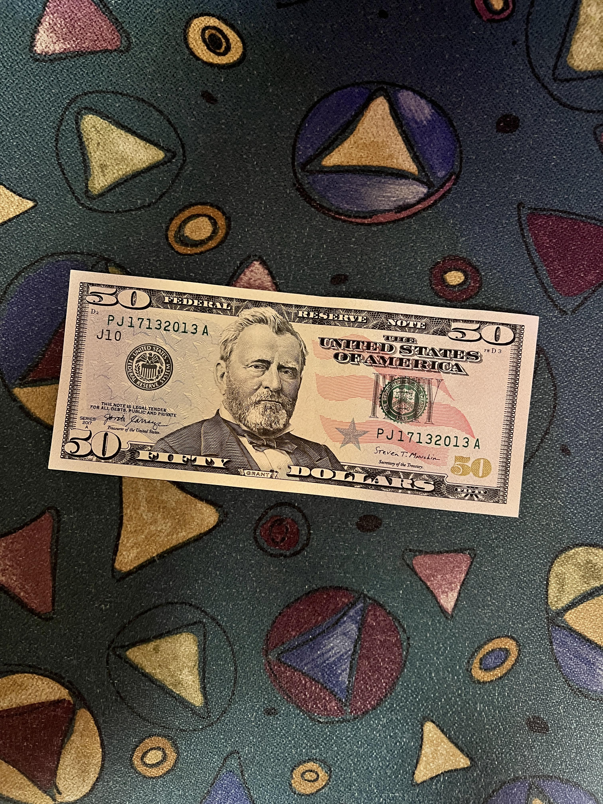

# Project 13 - Money Recognition
Final Project for ITCS 4152/5152 that can detect United States currency (dollar bills and coins)
## Team Members
- Soji Ademiluyi (contributed work earlier in the project but had to drop due to unfortunate circumstances)
- Ben Gambil
- Fausto German Jimenez
- Robert Wilk
- Joshua Wygal
## Problem and Motivation
We wanted to create a project that could be useful in a real-world scenario. After tossing a few ideas around, we landed on currency recognition. Currency Recognition can be beneficial for people with special needs and banks (Ex: couting the number of bills someone might have or counterfeit detection). We decided on creating a model that can detect the most common kinds of dollar bills and coins used in the United States.
## Dataset
The dataset used to train this model has a total of 957 images. The images were labeled using Computer Vision Annotation Tool (CVAT) and exported in Pascal VOC 1.0 format. Below is a tabel of the bills and coins we where trying to detect:

| Coin/Bill | Label Name  |
| ----------|:-----------:| 
| Penny     | Penny       | 
| Nickel    | Nickel      | 
| Dime      | Dime        | 
| Quarter   | Quarter     | 
| $1 bill   | OneBill     | 
| $2 bill   | TwoBill     | 
| $5 bill   | FiveBill    | 
| $10 bill  | TenBill     | 
| $20 bill  | TwentyBill  | 
| $50 bill  | FiftyBill   | 
| $100 bill | HundredBill | 

Below is a sample image from the data set:

We also performed data augmentation on our dataset to make sure the model could recognize money in different environments (scaling, rgb->grayscale, brightness shift, constrast shift).
## Methodology and Previous Works
Using the work of [Zhang et al.](https://doi.org/10.1007/s42786-018-00007-1) that compares different nerual network models on currency recognition, we decided to go with a Single Shot Detector (SSD) for the basis of our model. The SSD model takes in as input an image and ground truth bounding boxes, and outputs a bounding box as well as object class. Loss is calculated in two ways for this model:
- Confidence loss: the confidence of the object found in the box (utilizes softmax)
- Localization loss: the difference between the computed box and the ground truth (utilizes
Smooth L1)

[More information the implementation of the Single Shot Detector can be found here](https://arxiv.org/abs/1512.02325)

We decided to use MobileNet architecture with our SSD. The MobileNet architecture uses depthwise separable convolutions that are composed of depthwise and pointwise convolutions. The advantage of using depth-wise separable convolutions is that it performs a convolution on each color channel rather than one on all three channels at the same time.

[More information the implementation of the MobileNet can be found here](https://arxiv.org/abs/1704.04861)

In our final implementation of the project, we used a pretrained SSD MobileNet called [ssd_mobilenet_v2_fpnlite_640x640_coco17_tpu-8](https://github.com/tensorflow/models/blob/master/research/object_detection/configs/tf2/ssd_mobilenet_v2_fpnlite_640x640_coco17_tpu-8.config). This model combines the SSD model with the MobileNet architecture previously discussed. Features of the model:
- Uses 640x640 images
- Uses a weighted sigmoid focal cross entropy loss for classification
- Uses a weighted smooth L1 loss for localizationand uses convolutional layers

We did not include a custom head on top of the pretrained model. For training, we used a batch size of 10 and 5000 training steps.

## Results
- Average precision of 0.74 at 75% IoU
- Average recall of 0.80 at IoU between 50% and 95%
- Some things that we’ve noticed is that the model confuses rare coins as other types of coins. For example, the rare nickels in our dataset are being detected as dimes when on the tails side but detected as quarters when on the heads side.
- When currency is somewhat covered, unseen, or overlapping with other currency, the model will sometimes not recognize some bills or coins or may detect more currency than actually exists.

***Pictures of results are in the presentation slides***

Below is a link to our live demo code. There are many dependencies and configuration files that make it difficult to upload into GitLab.

[Live Demo Code Link](https://colab.research.google.com/drive/1GVNfIb9UySolUeaDAaeJ43f5kfoLIu60?usp=sharing)

## Conclusion
- We were able to create a model which could locate and classify U.S. currency in images
- Slight improvements to localization accuracy can be made by fixing some small labeling mistakes in a couple of the images in our dataset
- Classification accuracy improvements are possible if we add more images to our dataset that show the currency in greater detail and in better lighting
- Additionally, we need more images with our rare coins and bills so that the model can classify those more accurately
